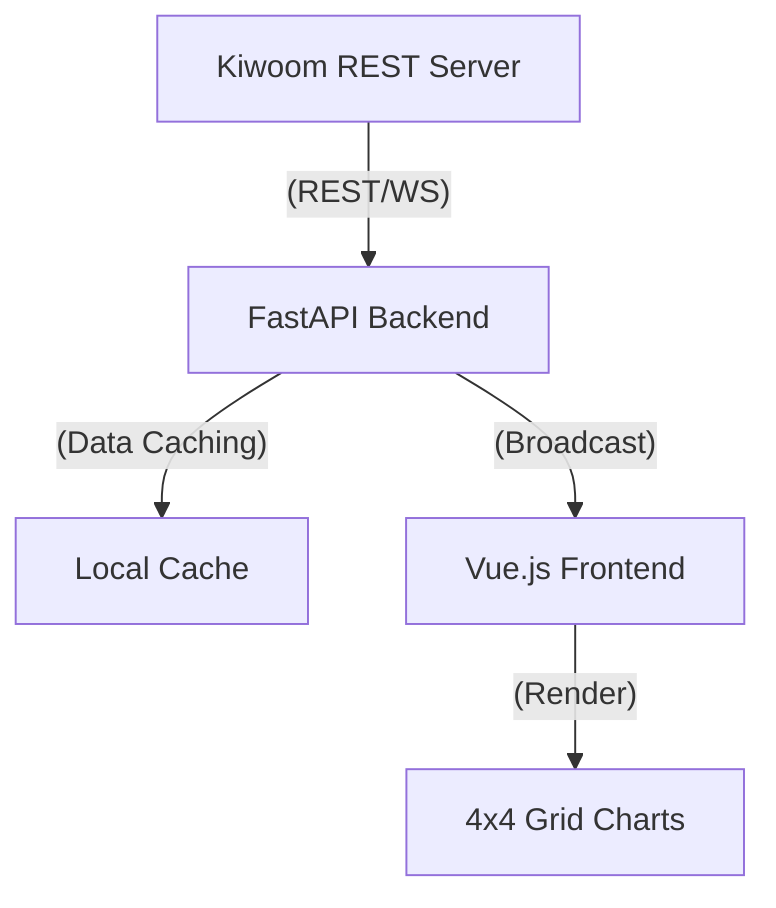

# 02_SRS: Software Requirements Specification (IEEE 830)

## 1. 소개 (Introduction)

### 1.1 목적 (Purpose)
- 본 문서는 키움 REST API 연동 기반 로컬 트레이딩 웹앱의 상세 기술 요구사항을 정의함.
- 개발팀(Frontend/Backend)이 시스템 설계 및 구현의 기준으로 삼는 것을 목적으로 함.

### 1.2 범위 (Scope)
- **포함**: 키움 API 연동 백엔드(FastAPI), 4x4 그리드 기반 프론트엔드(Vue.js), WebSocket 실시간 스트리밍, 로컬 데이터 보안 관리.
- **제외**: 모바일 앱 지원, 외부 클라우드 연동, 다중 사용자 지원(단일 사용자 로컬 전용).

### 1.3 정의 및 약어 (Definitions, Acronyms, and Abbreviations)
- **TR (Transaction)**: 키움 API에 데이터를 요청하고 받는 기본 단위.
- **Rate Limit**: 키움 API의 초당 조회 제한(5회/초).
- **Grid-16**: 4x4 형태의 16분할 차트 뷰.

---

## 2. 전반적인 설명 (Overall Description)

### 2.1 제품 관점 (Product Perspective)
- 본 시스템은 사용자의 로컬 환경(미니 서버)에서 독립적으로 실행되는 Standalone 웹 어플리케이션임.
- 외부망과는 키움증권 서버(REST API)하고만 통신함.

### 2.2 제품 기능 (Product Functions)
- **실시간 시세 수신**: WebSocket을 통한 16개 종목 동시 체결가 수신.
- **다중 차트 시각화**: 4x4 그리드 내 16개 Canvas 기반 차트 렌더링.
- **계좌 및 자산 조회**: 보유 종목 및 예수금 현황 실시간 업데이트.
- **보안 설정**: API Key 및 계좌 비밀번호의 로컬 암호화 저장.

### 2.3 사용자 특성 (User Characteristics)
- 금융 차트 분석 및 개인용 트레이딩 툴 구축을 원하는 숙련된 사용자.
- 로컬 서버 운영 및 기본적인 웹 인터페이스 조작 가능자.

### 2.4 제약 사항 (Constraints)
- **API 제약**: 키움 REST API의 조회 제한(초당 5회) 준수 필요.
- **하드웨어 제약**: 저사양 미니 서버에서도 구동 가능하도록 최적화된 리소스 사용.
- **기술 스택**: Vue.js (Frontend) + Python FastAPI (Backend).

### 2.5 가정 및 의존성 (Assumptions and Dependencies)
- 사용자는 유효한 키움증권 계좌와 API 사용 권한을 보유함.
- 로컬 네트워크 환경이 안정적이며, Python 3.9+ 및 Node.js 환경이 구축되어 있음.

---

## 3. 구체적인 요구사항 (Specific Requirements)

### 3.1 외부 인터페이스 요구사항
- **User Interface**: Vue.js 기반 반응형 그리드 시스템 (4x4 고정 뷰).
- **Software Interface**: Kiwoom Open API (RESTful), WebSocket Protocol.
- **Communication Interface**: Localhost (HTTP/HTTPS), WebSocket (WSS).

### 3.2 기능적 요구사항 (Functional Requirements)

#### [Workflow: Data Streaming]

- **FR-1: API 요청 스케줄링**: 백엔드는 키움 API 제한을 넘지 않도록 요청 큐(Request Queue)를 관리해야 함.
- **FR-2: 데이터 멀티플렉싱**: 백엔드는 1개의 WebSocket 연결을 통해 수신된 실시간 데이터를 프론트엔드의 16개 차트로 분배(Broadcast)해야 함.
- **FR-3: 차트 독립성**: 4x4 그리드의 각 차트는 개별 종목 및 분봉 설정을 독립적으로 유지해야 함.

### 3.3 성능 요구사항 (Performance Requirements)
- **Latency**: 시세 수신 후 차트 반영까지의 지연 시간 200ms 이내.
- **Concurrency**: 16개 차트 동시 구동 시 브라우저 프레임 30fps 이상 유지.
- **Memory**: 프론트엔드 메모리 점유율 500MB 이하 유지.

### 3.4 설계 제약사항 (Design Constraints)
- **Type Safety**: Python Pydantic 모델을 사용한 API 스키마 정의.
- **Coding Standard**: PEP 8 (Python), Vue Style Guide 준수.
- **Documentation**: 모든 API 엔드포인트는 Swagger(OpenAPI) 문서화.

### 3.5 소프트웨어 품질 속성
- **보안성**: API Key 노출 방지를 위해 환경 변수(`.env`) 사용 및 클라이언트 측 하드코딩 금지.
- **가용성**: 백엔드 에러 발생 시 자동 재연결 로직 구현.
- **유지보수성**: 기능 확장을 고려하여 데이터 수신부와 비즈니스 로직을 분리(Decoupled).

---

## 4. Verification & Summary
- **PRD 반영 확인**: 4x4 그리드, 키움 REST API 연동, 보안 및 로컬 서버 환경 요구사항 모두 반영됨.
- **주요 설계 결정**: 데이터 과부하 방지를 위한 '백엔드 캐싱 및 브로드캐스트' 구조 채택.
