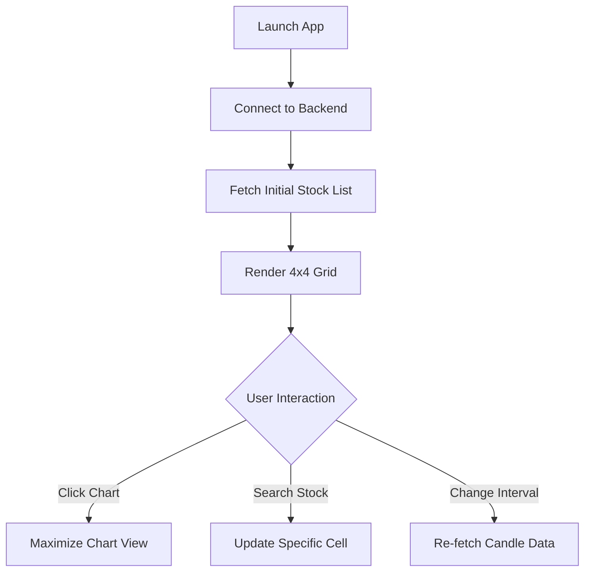

# 03_UIUX: Trading WebApp Design Specification

## 1. 디자인 원칙 (Design Principles)
- **High Information Density**: 16개 차트를 한눈에 볼 수 있도록 불필요한 여백 최소화.
- **Real-time Feedback**: 가격 변동 시 색상 변화(상승: Red, 하락: Blue)를 통한 즉각적인 인지 지원.
- **Low Cognitive Load**: 정보의 계층화를 통해 사용자 시선의 피로도 감소.

---

## 2. 디자인 시스템 (Design System)

### 2.1 Color System (Dark Mode Primary)
- **Background**: `#0F172A` (Deep Navy - 배경)
- **Surface**: `#1E293B` (Slate - 차트 카드 배경)
- **Primary**: `#3B82F6` (Blue - 주요 액션 및 포인트)
- **Trend Up**: `#EF4444` (Red - 가격 상승)
- **Trend Down**: `#3B82F6` (Blue - 가격 하락)
- **Text Primary**: `#F8FAFC` (White/Off-white)
- **Text Secondary**: `#94A3B8` (Grayish - 캡션 및 비활성 정보)

### 2.2 Typography
- **Font**: `Pretendard`, `Inter`, Sans-serif (가독성 중시)
- **H1 (Header)**: 24px, Bold
- **H2 (Stock Title)**: 16px, Semi-bold
- **Body**: 14px, Regular
- **Caption (Chart Data)**: 12px, Regular/Mono (숫자 가독성 위해 Monospace 권장)

### 2.3 Layout & Grid
- **Main Layout**: 4x4 CSS Grid (fr units: `1fr 1fr 1fr 1fr`)
- **Gap**: 4px (최대한 차트 영역을 확보하기 위해 좁은 간격 유지)
- **Padding**: Chart Card 내부 8px

---

## 3. 사용자 흐름 및 와이어프레임

### 3.1 사용자 흐름 (User Flow)


### 3.2 핵심 화면 와이어프레임 (Lo-Fi)

#### [Main Dashboard - 4x4 Grid]
```text
+-----------------------------------------------------------------------+
| [Header] Kiwoom Trading WebApp (Status: Connected)      [Config] [Log] |
+---------+---------+---------+---------+
| [Chart1]| [Chart2]| [Chart3]| [Chart4]|  <- Each cell contains:
|  AAPL   |  GOOG   |  TSLA   |  MSFT   |     - Symbol & Price
| [Graph] | [Graph] | [Graph] | [Graph] |     - Real-time Sparkline/Candle
+---------+---------+---------+---------+     - Interval Selector (1m, 5m, D)
| [Chart5]| [Chart6]| [Chart7]| [Chart8]|
|  ...    |  ...    |  ...    |  ...    |
+---------+---------+---------+---------+
| [Chart9]| [Chart10| [Chart11| [Chart12|
|  ...    |  ...    |  ...    |  ...    |
+---------+---------+---------+---------+
| [Chart13| [Chart14| [Chart15| [Chart16|
|  ...    |  ...    |  ...    |  ...    |
+---------+---------+---------+---------+
| [Footer] Kiwoom API Usage: 2.1 TR/sec | Memory: 156MB | Uptime: 2h 14m |
+---------------------------------------+
```

---

## 4. 인터랙션 및 마이크로 인터랙션
- **Price Flash**: 실시간 체결가 수신 시 텍스트 배경이 살짝 반짝이며 가독성 증대.
- **Hover State**: 차트 셀 오버 시 '종목 상세', '삭제', '설정' 버튼 노출.
- **Loading State**: 차트 데이터 로딩 중 스켈레톤 UI(Skeleton Screen) 제공으로 심리적 대기 시간 단축.
- **Error Feedback**: API 제한 도달 시 하단 푸터에 경고 아이콘 및 메시지 스택 표시.

---

## 5. Verification
- **SRS 반영 확인**: 4x4 그리드 레이아웃, 실시간 데이터 시각화, 보안 및 상태 표시 요구사항이 UI에 모두 반영됨.
- **특이사항**: 16개 차트 동시 구동 시 시각적 혼란을 막기 위해 '포커스 모드(클릭 시 해당 차트 확대)' 기능을 추가 설계함.
