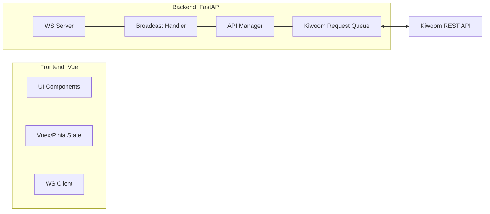
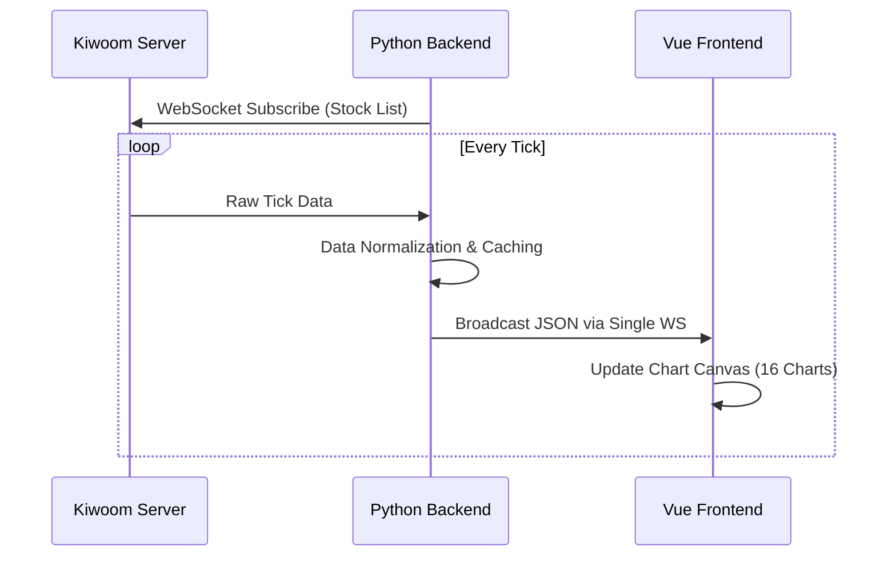
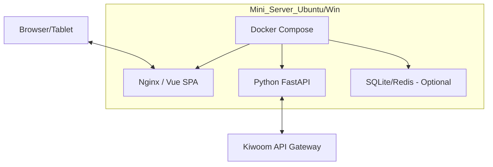

# 04_Architecture: High-Performance Trading System Design

## 1. 이해관계자 및 우려사항 (Stakeholders and Concerns)
- **개인 트레이더 (User)**: 실시간 시세의 정확성, 4x4 그리드 로딩 속도, 계좌 정보 보안.
- **개발자/유지보수자**: 키움 API 정책 변경 대응 용이성, 코드 확장성.
- **미니 서버 (Infrastructure)**: CPU/메모리 리소스 점유율 최소화, 24/7 안정성.

---

## 2. 아키텍처 뷰 (Architecture Views)

### 2.1 논리적 뷰 (Logical View)

- **[Decision]**: 프론트엔드와 백엔드를 엄격히 분리하여, 백엔드는 데이터 수집 및 정제에 집중하고 프론트엔드는 렌더링에 최적화함.

### 2.2 프로세스 뷰 (Process View) - 실시간 시세 흐름

- **[Decision]**: 16개 차트가 각각 API를 호출하지 않고, 백엔드에서 하나의 스트림으로 묶어 브로드캐스트함으로써 네트워크 부하 및 API 호출 횟수를 획기적으로 절감함.

### 2.3 배포 뷰 (Deployment View)

- **[Decision]**: 로컬 미니 서버 내에서 Docker 또는 Standalone 프로세스로 실행하여 외부 노출을 차단하고 보안을 강화함.

---

## 3. 기술 스택 및 선정 근거 (Technology Stack)

| 레이어 | 선정 기술 | 선정 근거 |
| :--- | :--- | :--- |
| **Frontend** | Vue.js 3 + Vite | 빠른 초기 로딩 및 컴포넌트 기반 4x4 그리드 구현 용이 |
| **Chart Lib** | Lightweight Charts | TradingView 개발사의 초경량 라이브러리. 16개 동시 렌더링 시 메모리 효율 극대화 |
| **Backend** | Python FastAPI | 비동기(Asyncio) 처리를 통해 WebSocket 동시 접속 및 API 비차단(Non-blocking) 요청 처리 |
| **API Client** | HTTPX | 비동기 HTTP 요청을 지원하여 키움 REST API 연동 시 성능 우위 |

---

## 4. 아키텍처 결정 기록 (ADR)

### [Decision 1] Single WebSocket Multiplexing
- **내용**: 16개의 차트를 위해 16개의 소켓을 열지 않고, 1개의 소켓에서 모든 데이터를 수신 후 클라이언트 사이드에서 분배함.
- **이유**: 브라우저의 동시 연결 수 제한을 회피하고 서버 리소스를 절약함.

### [Decision 2] Request Rate Limiter (Token Bucket)
- **내용**: 키움 API 요청 시 초당 5회 제한을 지키기 위한 토큰 버킷 알고리즘 적용.
- **이유**: API 제한 위반으로 인한 계정 차단 방지 및 서비스 안정성 확보.

### [Decision 3] Memory-First Caching
- **내용**: 실시간 체결가는 DB에 매번 저장하지 않고 백엔드 메모리(또는 Redis)에 캐싱 후 필요 시 배치(Batch) 저장.
- **이유**: 미니 서버의 디스크 I/O 부하 감소 및 응답 속도 향상.

---

## 5. Verification
- **아키텍처 원칙 준수 확인**:
  - `Logic-First`: 핵심 비즈니스 로직(제한 관리, 데이터 정제)을 백엔드에 배치함.
  - `Explicit Typing`: FastAPI Pydantic 및 TypeScript/JSDoc 활용 예정.
  - `Performance`: Lightweight Charts 및 Asyncio를 통한 저지연 시스템 설계 완료.
- **위반 사례**: 없음. (vtk.js 대신 Lightweight Charts를 선정했으나, 이는 도메인 특화 및 메모리 관리 측면에서 원칙의 정신을 계승함)
